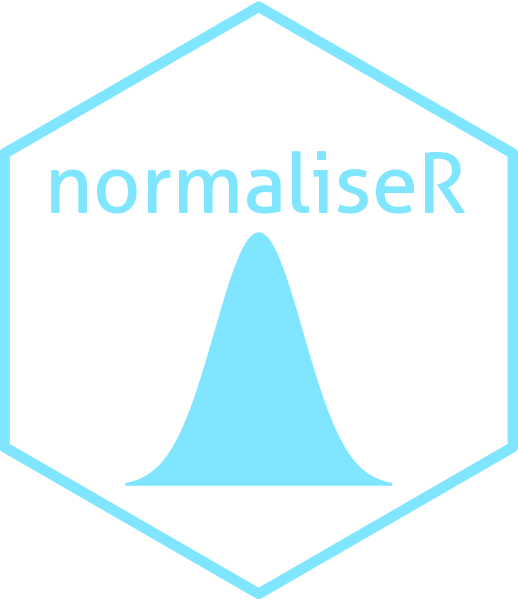

# normaliseR 

Rescale Vectors and Time-Series Features

```{r, include = FALSE}
knitr::opts_chunk$set(
comment = NA, fig.width = 12, fig.height = 8, cache = FALSE)
```

## Installation

You can install the development version of `normaliseR` from GitHub using the following:

```{r eval = FALSE}
devtools::install_github("hendersontrent/normaliseR")
```

## General purpose

`normaliseR` is a software package for R for rescaling numerical vectors or `feature_calculations` objects produced by the [`purloiner`](https://github.com/hendersontrent/purloiner) package. It was specifically designed to be the rescaling module of the broader feature-based time-series 'mothership' package [`theft`](https://github.com/hendersontrent/theft).

Putting calculated feature vectors on an equal scale is crucial for any statistical or machine learning model as variables with high variance can adversely impact the model's capacity to fit the data appropriately, learn appropriate weight values, or minimise a loss function. `normaliseR` includes function `normalise` (or `normalize`) to rescale either a whole `feature_calculations` object, or a single vector of values. The following normalisation methods are currently offered:

* z-score---`"zScore"`
* Sigmoid---`"Sigmoid"`
* Outlier-robust Sigmoid (credit to Ben Fulcher for creating the original [MATLAB version](https://github.com/benfulcher/hctsa)) -- `"RobustSigmoid"`
* Min-max---`"MinMax"`
* Maximum absolute---`"MaxAbs"`
